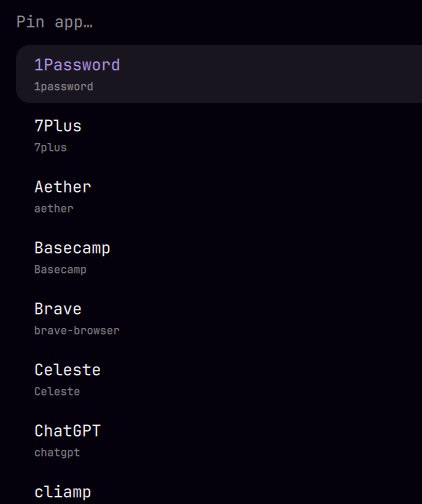

# Taskbar

A pinned application launcher for the [Omarchy](https://omarchy.org/) bar.

Each pinned app is one icon in the bar. Click it to launch the app — or to
focus it, when it already has a window open. A small indicator under each icon
shows what's running, and highlights the app you're currently focused on.

Apps are pinned and unpinned from the bar itself. No config file editing
required, though the config stays plain and hand-editable if you prefer it.


Built as a third-party `bar-widget` plugin for `omarchy-shell` (Omarchy 4+).

## Install

```bash
omarchy plugin add https://github.com/joeyvigil/omarchy-taskbar.git --enable --yes
omarchy bar move io.github.joeyvigil.taskbar --section left
```

## Requirements

- Omarchy 4+ (`omarchy-shell`), which provides the bar and the plugin host.
- The built-in `omarchy.menu` plugin, enabled. The `+` and the right-click
  actions are rendered by summoning it in select mode; with it disabled the
  icons still launch and focus, but the editing menus will not open.
- `jq`, used by `bin/taskbar-pick`. It is already a hard dependency of
  `omarchy` itself, so it is present on any Omarchy system.

No other external tools, services, or network access.

## Remove

```bash
omarchy plugin remove io.github.joeyvigil.taskbar
```

That unregisters the widget and deletes the checkout. Removal takes the pin
list with it, because Omarchy stores widget settings inline on the bar layout
entry — copy the `apps` array out of `~/.config/omarchy/shell.json` first if
you want to keep it.

## Using it

| Input | What it does |
|---|---|
| **Left click** | Launch the app, or focus it if it's already running |
| **Left click** (already focused) | Cycle to that app's next window |
| **Middle click** | Always launch a new instance |
| **Right click** | Open actions: new instance, move left/right, unpin |
| **Click the `+`** | Pin an app, from a searchable list of everything installed |
| **Hover** | App name, plus window count when more than one is open |

Both menus are the Omarchy menu in its select mode, so they search and look
like everything else in the system.



The `+` sits dimmed at the end of the strip and brightens on hover. Turn it off
with `showAddButton` once you've settled on a set.

### Smart matching

The running indicator only lights up if the plugin can tell which windows
belong to a pinned app. When you pin through the `+`, it works this out for you:

- Apps declaring `StartupWMClass` get that class stored as their match.
- Omarchy web apps get a pattern derived from their URL, because Chromium
  reports them with classes like `chrome-discord.com__channels_@me-Default`.
- Apps whose window class already resembles their desktop id get nothing
  stored, keeping the config clean.

So pinning Google Maps from the `+` just works, without you ever finding out
what a window class is.

### From the command line

```bash
omarchy-shell io.github.joeyvigil.taskbar list             # current pins, as JSON
omarchy-shell io.github.joeyvigil.taskbar pin obsidian     # pin by desktop entry id
omarchy-shell io.github.joeyvigil.taskbar unpin obsidian   # unpin
omarchy-shell io.github.joeyvigil.taskbar add              # open the pin picker
```

Handy for keybindings, or for adding a "Pin app to taskbar" entry to
`~/.config/omarchy/extensions/omarchy-menu.jsonc`.

## Configuration

Settings live inline on the widget's entry in `~/.config/omarchy/shell.json`,
which hot-reloads on save. The UI writes to this same place.

```json
{
  "id": "io.github.joeyvigil.taskbar",
  "apps": ["Alacritty", "chromium", "code"],
  "iconSize": 17,
  "spacing": 2,
  "runningIndicator": true,
  "dimWhenClosed": true,
  "cycleWindows": true,
  "showAddButton": true
}
```

| Key | Default | Meaning |
|---|---|---|
| `apps` | `[]` | The pinned entries, in bar order |
| `iconSize` | `17` | Icon edge length in pixels |
| `spacing` | `2` | Gap between icons in pixels |
| `runningIndicator` | `true` | Draw the running/focused indicator |
| `dimWhenClosed` | `true` | Fade icons for apps with no open window |
| `cycleWindows` | `true` | Re-clicking a focused app advances to its next window |
| `showAddButton` | `true` | Show the trailing `+` for pinning apps |

> **Disabling the widget discards your pins.** Omarchy stores widget settings
> inline on the bar layout entry, and disabling removes that entry. This is how
> every bar widget behaves, but here it means the whole pin list. Copy the
> `apps` array first if you plan to disable and re-enable.

### Pinned entries

The short form is a desktop entry id, without the `.desktop` suffix:

```json
"apps": ["Alacritty", "org.gnome.Nautilus", "code"]
```

The long form takes overrides:

```json
"apps": [
  "Alacritty",
  { "desktopId": "code", "match": "^Code$", "label": "Editor" },
  { "label": "Scratch VM", "icon": "computer", "exec": "uwsm-app -- virt-manager", "match": "virt-manager" }
]
```

| Field | Meaning |
|---|---|
| `desktopId` | Desktop entry id. Supplies the icon, name, and launch command. |
| `match` | Regex matched case-insensitively against window app id and class. Used **raw** — add your own `^…$` or `\b…\b` if you want anchoring. Defaults to a word-boundary match on the desktop id. |
| `exec` | Launch command override. Takes precedence over `desktopId`. |
| `icon` | Icon name or absolute path override. |
| `label` | Tooltip override. |
| `matchTitle` | Also match the regex against window titles. Off by default — titles produce false positives for browsers. |

### When an icon never lights up

Check what the compositor actually reports, then set `match` accordingly:

```bash
hyprctl clients -j | jq -r '.[] | "\(.class)\t\(.title)"'
```

## Development

```
manifest.json      plugin declaration and setting schema
BarWidget.qml      the widget the bar mounts
AppModel.js        entry normalization, window matching, list editing
bin/taskbar-pick   shows a list in the Omarchy menu, prints the choice
```

Two things worth knowing before changing this code:

**Settings arrays are not `Array`s.** Values from `shell.json` round-trip
through a QML `property var`, which stores JS arrays as `QVariantList`. What
comes back is array-*like* but fails `Array.isArray`, so `AppModel.toArray`
duck-types on `length` instead. Trusting `Array.isArray` silently drops every
pinned app at cold start while still working under hot-reload, which makes it a
nasty one to catch — always test with `omarchy restart shell`, not just a save.

**Pins are persisted in-process,** through the shell's own `mutateShellConfig`.
The tidier `omarchy bar set <id> apps '[…]' --json` cannot be used: it forwards
through `qs ipc call`, which splits every argument on commas, so any array past
one element arrives as extra positional arguments and the call is rejected.

Files under `~/.config/omarchy/plugins/` hot-reload on save. If you develop from
a checkout elsewhere and symlink it in, `inotify` won't see through the symlink
— reload by hand with `omarchy-shell shell rescanPlugins`, and restart the
shell outright when you touch anything settings-related.

## License

MIT
